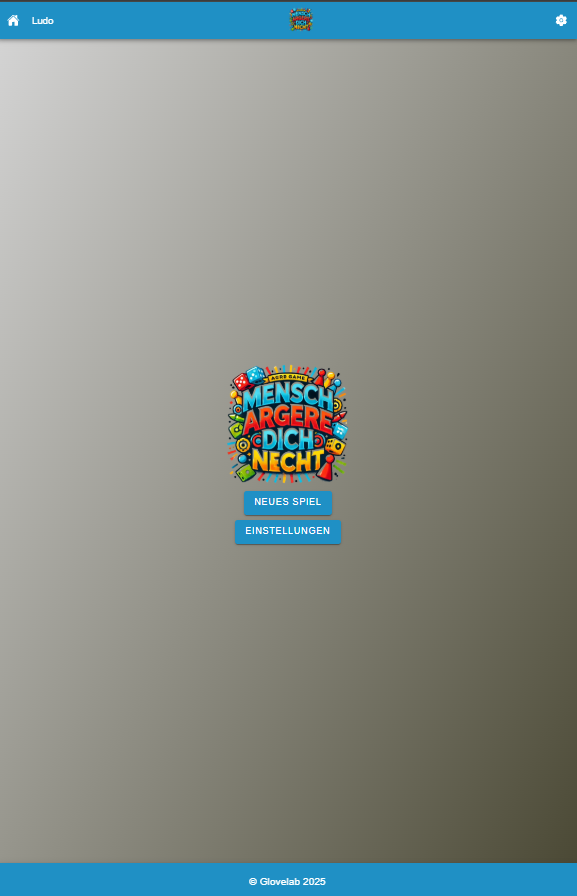
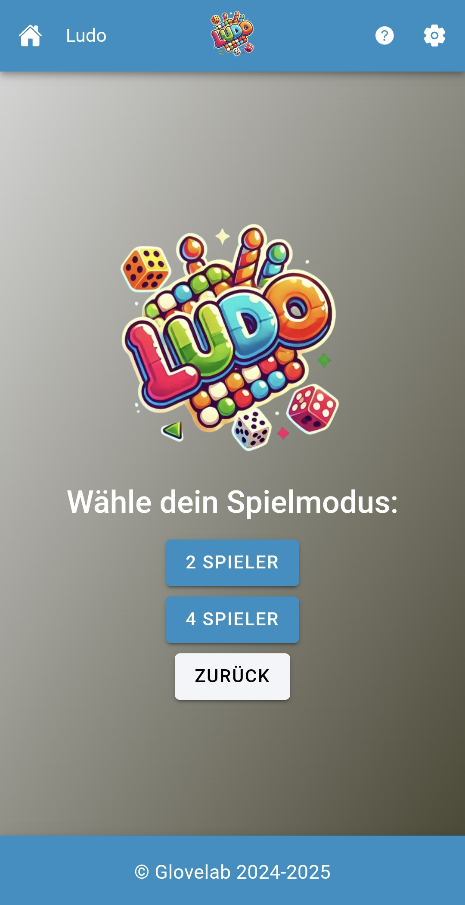
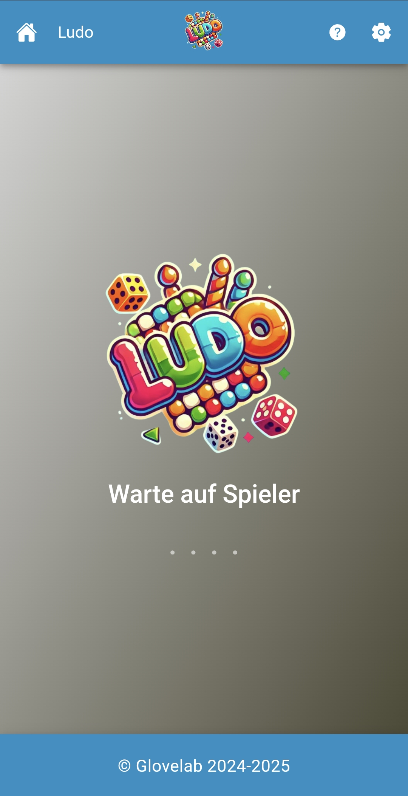
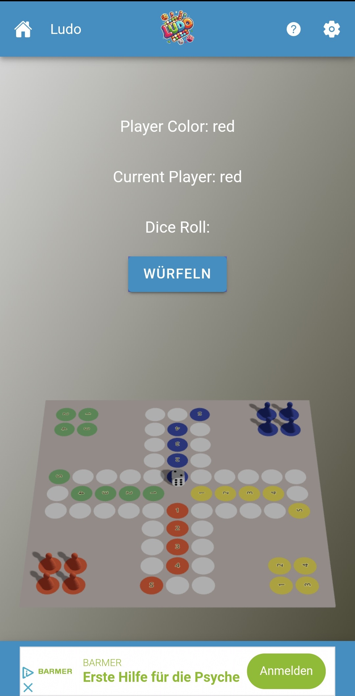

# Ludo Online (Beta)

## Demo
[**Hier geht's zur Demo-Seite!**](https://game.ludo.x3.dynu.com/)

---

## Screenshots

### Splash Screen


### Mainscreen


### Game Selection


### Querry Screen


### Game Screen


---

## Über das Projekt

Ludo Online ist ein Echtzeit-Multiplayer-Spiel, das mit moderner Technologie umgesetzt wurde, um eine reibungslose und spannende Spielerfahrung zu bieten. Die Beta-Version gibt dir einen ersten Einblick in die Funktionen und das Gameplay.

### Features
- **Multiplayer-Unterstützung:** Spiele mit deinen Freunden in Echtzeit.
- **Echtzeit-Kommunikation:** Schnelle und stabile Interaktionen zwischen Spielern.
- **3D-Visualisierung:** Dynamische Spielfelder für ein immersives Erlebnis.
- **Plattformübergreifend:** Spielbar auf Desktop und mobilen Geräten.

### Technologien
- **Frontend:** Ionic, React, Three.js, Capacitor
- **Backend:** Node.js, Express, Socket.IO, Docker
- **Datenbank:** MySQL (für Spielerstatistiken und Match-Tracking)

---

## Installation und Setup

### Voraussetzungen
- Node.js (v18 oder höher)
- Docker (falls gewünscht für Deployment)

### Lokale Installation
1. **Repository klonen:**
   ```bash
   git clone https://github.com/xheen908/ludo-online-beta.git
   cd ludo-online-beta
   cd ludo-server
   ```

2. **Server Abhängigkeiten installieren:**
   ```bash
   npm install
   ```

3. **Web Demo Abhängigkeiten installieren:**
   ```bash
   cd ludo-app
   npm install
   ```

3. **Backend + WebDemo starten:**
   ```bash
    cd ..
    node server.js
   ```

4. **Im Browser öffnen:**
   ```
   http://localhost:8888
   ```

### Deployment mit Docker
1. **Docker-Container erstellen:**
   ```bash
   docker build -t ludo-online .
   ```

2. **Container starten:**
   ```bash
   docker run -p 8888:8888 ludo-online
   ```

---

## Feedback und Kontakt

Hast du Feedback, Vorschläge oder Bugs gefunden? Erstelle ein [Issue](https://github.com/xheen908/ludo-online-beta/issues) oder kontaktiere mich direkt unter **xheen908@gmail.com*.

---

## To-Do
- Asymetrische Wüfel Physicalisch Server Seitig + Visual feedback Frontend
- Animationen
- mehr Spielsounds ...
- Verbesserungen am UI/UX
- Integration eines Rankingsystems
- Erweiterung der Spielmodi

---

### Viel Spaß beim Testen der Beta-Version! 😊
